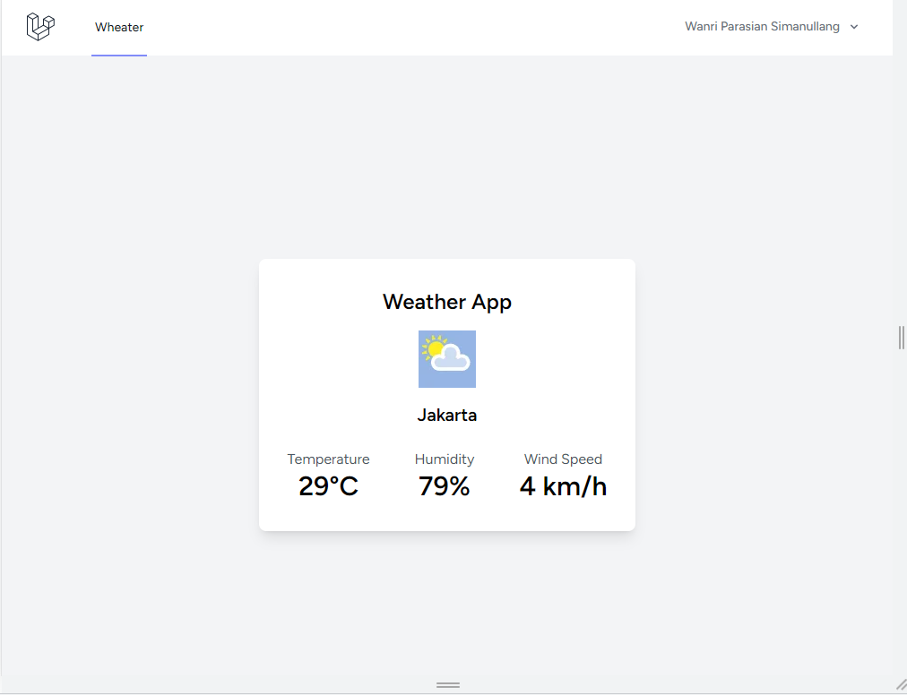

**Laravel Breeze**
Laravel Breeze adalah starter kit untuk membuat aplikasi web dengan Laravel dan Vue.js yang sangat minimalis dan cepat.

**Fitur**
Laravel Breeze menyediakan fitur-fitur dasar yang dibutuhkan dalam sebuah aplikasi web, antara lain:

-Autentikasi pengguna
-Registrasi pengguna
-Verifikasi email
-Pengaturan profil pengguna
-Reset kata sandi
-Halaman dashboard

**Persyaratan**
PHP 7.3 atau yang lebih baru
Composer
Node.js dan npm

**Instalasi**

1. Clone repositori ini:

```bash
git clone git@github.com:wanrimanullang/simple-weather-with-laravel-breeze-vue.git
```

2. Masuk ke direktori yang telah diunduh dan pasang dependensi PHP menggunakan Composer:

```bash
cd breeze
composer install
```

3. Buat environment file dari file contoh:

```bash
cp .env.example .env
```

4. Buat app key dengan menjalankan perintah:

```bash
php artisan key:generate
```

5. Atur koneksi ke database pada file .env.
6. Migrasikan database dan isi dengan data dummy menggunakan perintah:

```bash
php artisan migrate --seed
```

7. Pasang dependensi JavaScript menggunakan npm:

```bash
npm install
```

**Penggunaan**
Untuk menjalankan aplikasi, jalankan perintah:
```bash
php artisan serve
```

**Lisensi**
Laravel Breeze menggunakan lisensi MIT, yang artinya Anda bebas untuk menggunakannya untuk proyek pribadi maupun komersial tanpa perlu membayar biaya lisensi. Lihat berkas LICENSE untuk informasi lebih lanjut.